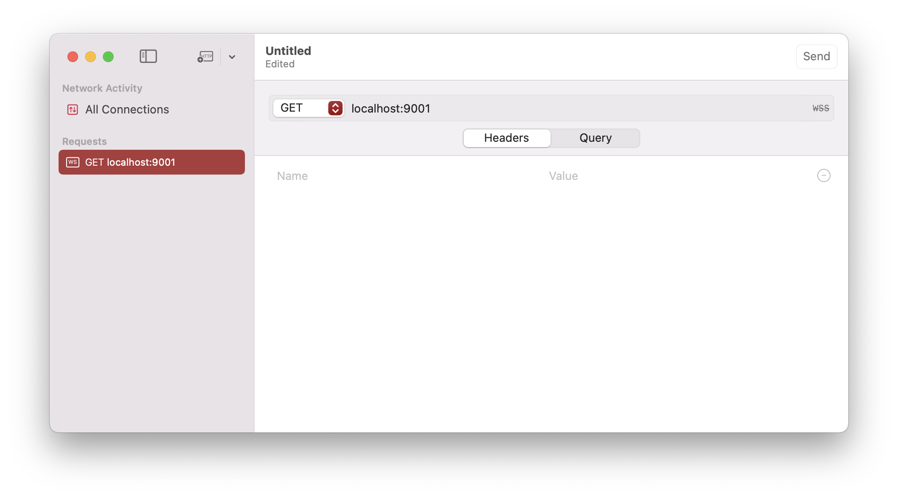
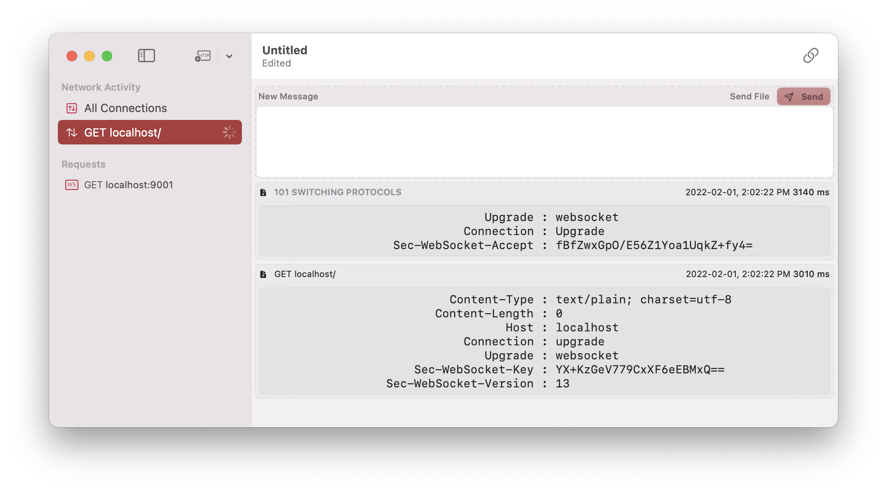
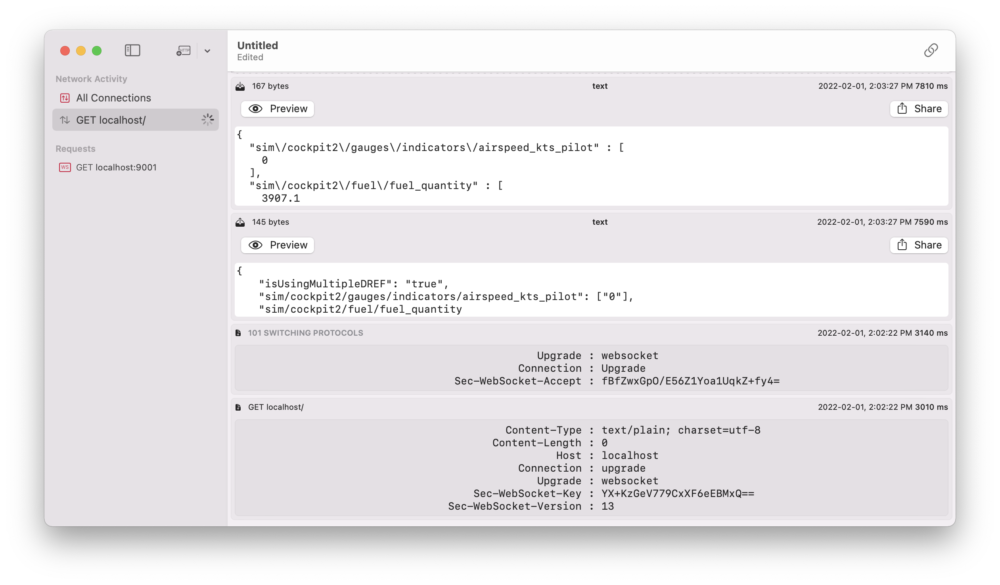

# X-Plane Connect Web Server

@Jean-Baptiste Waring

```objectivec
#import <Foundation/Foundation.h>

NSString *welcome = [[NSString alloc] init:@"Welcome to our page :)!"];
NSLog(@"%@", welcome);
```

## 📗 Source Control

The X-Plane Connect Web Server project is hosted on GitHub as a **public repository.**

[https://github.com/jbwaring/XPC-Web-Server](https://github.com/jbwaring/XPC-Web-Server)

## 🧭 High Level Goals

- Read multiple DREFs at a time
- Write multiple DREFs at a time
- Provide an error detection mechanism

## 🗃️ Code Documentation

### `main.m`

If your are new to Objective-C, `.m` corresponds to an implementation file while `.h` is a header file.

`main` returns an instance of `NSApplicationMain` and is the entry point of the executable.

```objectivec
#import <Cocoa/Cocoa.h>

int main(int argc, const char * argv[]) {
    @autoreleasepool {
        // Setup code that might create autoreleased objects goes here.
    }
    #if DEBUG
    NSLog(@"XPC Connect Web Server\n(c) Jean-Baptiste Waring 2022");
    #endif
    return NSApplicationMain(argc, argv);
}
```

### App Delegate

We subclass the `AppDelegate` to be a delegate of `PSWebServerDelegate`

```objectivec
#import <Cocoa/Cocoa.h>
#import <PSWebSocketServer.h>

@interface AppDelegate : PSWebSocketServer <PSWebSocketServerDelegate>

@property (nonatomic, strong) PSWebSocketServer *server;

@end
```

We implement all the delegate-stubs in `AppDelegate.m`

```objectivec
#import "AppDelegate.h"
#import "XPCRequestHandler.h"

@implementation AppDelegate

- (void)applicationDidFinishLaunching:(NSNotification *)notification {
  // Implementation
}

#pragma mark - PSWebSocketServerDelegate

- (void)serverDidStart:(PSWebSocketServer *)server {
     // Implementation
}
- (void)serverDidStop:(PSWebSocketServer *)server {
    // Implementation
}
- (BOOL)server:(PSWebSocketServer *)server acceptWebSocketWithRequest:(NSURLRequest *)request {
     // Implementation
}
- (void)server:(PSWebSocketServer *)server webSocket:(PSWebSocket *)webSocket didReceiveMessage:(id)message {
     // Implementation
}
- (void)server:(PSWebSocketServer *)server webSocketDidOpen:(PSWebSocket *)webSocket {
    // Implementation
}
- (void)server:(PSWebSocketServer *)server webSocket:(PSWebSocket *)webSocket didCloseWithCode:(NSInteger)code reason:(NSString *)reason wasClean:(BOOL)wasClean {
    // Implementation
}
- (void)server:(PSWebSocketServer *)server webSocket:(PSWebSocket *)webSocket didFailWithError:(NSError *)error {
     // Implementation
}

- (void)server:(PSWebSocketServer *)server didFailWithError:(NSError *)error {
     // Implementation
}

@end
```

We initialize `server` as `PSWebServer` in the `applicationDidFinishLaunching` function as follows:

```objectivec
- (void)applicationDidFinishLaunching:(NSNotification *)notification {
// host is localhost (127.0.0.1) and the port is whatever is available on the system.
    _server = [PSWebSocketServer serverWithHost:@"127.0.0.1" port:9001];

// Set the server's delegate as self to reference the AppDelegate (its own class)
		_server.delegate = self;

// Start the server
    [_server start];

// Quick check to see if X-Plane is live.
    if([XPCRequestHandler testXPlaneConnect] < 0){
        // TODO: Deal with error and tell the user through the GUI.
    }
}
```

The main function of interest is `didReceiveMessage` which will be called whenever the socket receives a message. Each time a message is received, an instance of `PSWebSocket` is created and passed to the callback. We need to pass it to our request handler since this `PSWebSocket*` will enable to reply to the sender.

This mode of operation means that we can abstract each connection to only have a single guest. In other words, we can reply very easily by messaging: `[webSocket send:(id)@"Message you'd like to send"];` and be sure that the message will be sent to the original sender.

```objectivec
- (void)server:(PSWebSocketServer *)server webSocket:(PSWebSocket *)webSocket didReceiveMessage:(id)message {

// Received (id) message and an instance of PSWebSocket*
// Pass it to XPCRequestHandler

    [XPCRequestHandler handleRequest:message andSocket:webSocket];

}
```

### `XPCRequestHandler`

This singleton class is the request handling class used to call NASA’s `xplaneConnect`.

It:

- determines wether the request is a single or multiple DREFs
- converts the `json` payload to an `NSMutableDictionnary`
- determines wether it is a `read` or `write` operation
- calls the relevant `xplaneConnect` method
- converts the results to an `NSMutableDictionnary` and then to a `json` string
- sends it back to the initial sender.

```objectivec
#import <Foundation/Foundation.h>
#import <PSWebSocketServer.h>
#import "xplaneConnect.h"

NS_ASSUME_NONNULL_BEGIN

@interface XPCRequestHandler : NSObject

@property (class, atomic) XPCSocket xpcSocket;

// Main entry point
+(void) handleRequest:(id) message andSocket:(PSWebSocket*)socket;

// is called if isUsingMultipleDREF flag is set to true
+(void) handleMultipleDREFsRequest:(NSMutableDictionary*)request andSocket:(PSWebSocket*)socket;
// TODO handleSingleDREFRequest
+(int) testXPlaneConnect;

@end

NS_ASSUME_NONNULL_END
```

Let us look take a look at `handleMultipleDREFsRequest` to understand how that works.

The payload has already been parsed into an `NSMutableDictionnary` by `handleRequest` and a pointer to the `PSWebSocket` associated with the request is passed.

```objectivec
+(void) handleMultipleDREFsRequest:(NSMutableDictionary*)request andSocket:(PSWebSocket*)socket {

// Weird bug, it seems *data is casted to (NSDictionnary*) which is not mutable
// Make a mutable copy
    NSMutableDictionary *data = [request mutableCopy];

// Remove the flag (we are already in the right function)
    [data removeObjectForKey:@"isUsingMultipleDREF"];

// For debug executable, print debinfo.
#if DEBUG
    NSLog(@"Looking for %lu DREFS", data.count);
#endif

    // Get the drefs as char**
    char** drefsAsCString;

// Allocate enough memory (look closely to understand what is going on)
    drefsAsCString=(char **)malloc(data.count * sizeof(char *));

    { //Minimum Scope for i to be re-used.
        int i = 0;

//Iterate over the DREFS (keys)
        for(NSString* key in data){

// Copy the DREF to drefsAsCString (notice we use to malloc again because this is a 2D array)
            drefsAsCString[i]= (char*) malloc( key.length * sizeof(char));

// Make the copy
            strcpy(drefsAsCString[i], [key cStringUsingEncoding: NSUTF8StringEncoding]);
            i++;
        }
    }

// print the DREFs (for debinfo)
#if DEBUG
    for(int i = 0; i < data.count; i++){
        printf("\nRequesting DREFs[%d] = %s", i, drefsAsCString[i]);
    }
#endif

    // Get size[]
    int sizes[data.count];

    for(int i = 0 ; i < data.count ; i++){
        sizes[i] = 16; // Set the sizes to be all be 16 (xplaneConnect will NULL what we don't need)

    }

    // Get float*
    float* values[data.count];

    for(int i = 0 ; i < data.count ; i++){
        values[i] = (float*) malloc( sizes[i] * sizeof(float));
    }

    //getDREFS

//TODO add an IP parameter to open a UDP connection outside of localhost.
    XPCSocket sock = openUDP("127.0.0.1"); // Open a UDP Socket on localhost

    getDREFs(sock, (const char**)drefsAsCString, values, data.count, sizes);

#if DEBUG
    for( int i = 0 ; i < data.count ; i++){
        printf("\n Sizes[i] updated to %d ", sizes[i]);
    }
    for( int i = 0 ; i < data.count ; i++){
        printf("\nDREF %s ", drefsAsCString[i]);
        for( int j = 0 ; j < sizes[i] ; j++) {
            printf(" %f ", values[i][j]);
        }
    }
#endif

    // Update MutableDictionnay
    NSMutableDictionary *responseData = [[NSMutableDictionary alloc] init];
    { //Minimum Scope for i to be re-used.
        int j = 0;
        for(NSString* key in data){
            NSMutableArray* valueArray = [[data objectForKey:key] mutableCopy];
            for(int i = 0; i < [valueArray count]; i++){
                int index = (int)[[valueArray objectAtIndex:i] integerValue];

                [valueArray setObject:[NSNumber numberWithFloat:values[j][i]] atIndexedSubscript:index];
            }
            [responseData setObject:valueArray forKey:key];
            NSLog(@"%@", valueArray);
            j++;
        }
    }
    NSError *error;
    NSData *jsonData = [NSJSONSerialization dataWithJSONObject:responseData
                                                       options:NSJSONWritingPrettyPrinted // Pass 0 if you don't care about the readability of the generated string
                                                         error:&error];

    if (! jsonData) {
        NSLog(@"Got an error: %@", error);
    } else {
        NSString *jsonString = [[NSString alloc] initWithData:jsonData encoding:NSUTF8StringEncoding];
        NSLog(@"\n\n JSON: %@", jsonString);
        [socket send:jsonString]; // Finaly we send the data back to the sender.
    }


}
```

### Anatomy of a Request / Response JSON payload

A request looks something like:

```json
// REQUEST
{
  "isUsingMultipleDREF": "true",
  "sim/cockpit2/gauges/indicators/airspeed_kts_pilot": ["0"],
  "sim/cockpit2/fuel/fuel_quantity": ["0", "1"]
}
```

Where the `Int` arrays represent the _index_ of the `float*` associated with each DREF.

A response mirrors the request, replaces the index with its associated `float` value, and removes flags (they are no longer necessary).

```json
// RESPONSE
{
  "sim/cockpit2/gauges/indicators/airspeed_kts_pilot": ["0.00000000"],
  "sim/cockpit2/fuel/fuel_quantity": ["2450.34430000", "4675.98630000"]
}
```

## Testing XPC Web Server with Cleora

Requirements: macOS Monterey (12.0 and later), Xcode, XPC Web Server built and running, Cleora and X-Plane (is running before we start).

- Start Cleora and create a `ws` request on `locahost:9001`



- Send the request, the connection is upgraded to `websocket`



- Send the sample payload previously shown:
  

The response will be parsed into a javascript object by the client.

```json
{
  "sim/cockpit2/gauges/indicators/airspeed_kts_pilot": [0],
  "sim/cockpit2/fuel/fuel_quantity": [3907.146728515625, 2569.68212890625]
}
```

Congrats, you successfully requested and got multiple DREFs at once.
